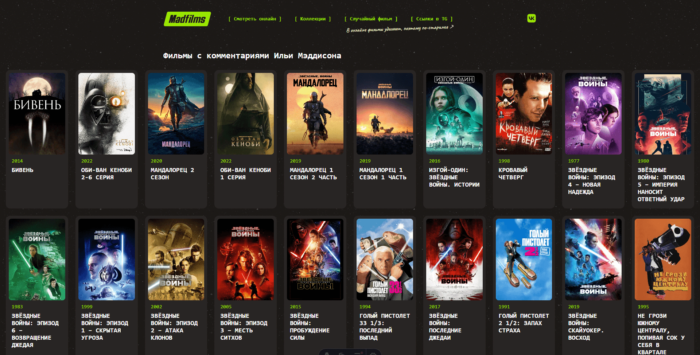

# Madfilms

Веб-каталог фильмов и сериалов, которые посмотрел и прокомментировал **Илья Мэддисон** на своих стримах.

Сайт предоставляет удобный доступ к записям кинотрансляций со встроенным плеером и резервными ссылками на внешние платформы.



## Основные возможности

- **Онлайн-просмотр** — встроенные плееры на странице фильма.
- **Тематические коллекции** — подборки по франшизам и сериям.
- **Случайный фильм** — быстрая рекомендация фильма через специальную кнопку в шапке сайта.

## Cтек

- **Фреймворк:** [Astro](https://astro.build) (гибридный SSR/SSG рендеринг)
- **Стилизация:** [Tailwind](https://tailwindcss.com) (через `@tailwindcss/vite`)

## Структура проекта

```text
madfilms/
├── public/                  # Статические файлы
├── src/
│   ├── assets/              # Исходные медиафайлы для автоматической оптимизации Sharp
│   ├── components/          # Astro-компоненты
│   ├── content/             # Markdown-файлы с фильмами (Content Collections)
│   │   └── blog/            # Записи о фильмах
│   ├── data/                # JSON-датасеты (коллекции, ссылки)
│   ├── layouts/             # Шаблоны страниц
│   ├── pages/               # Маршруты и страницы
│   │   ├── api/             # API эндпоинты
│   │   ├── collections/     # Страницы коллекций
│   │   ├── links/           # Страница ссылок в Telegram
│   │   ├── [slug].astro     # Динамическая страница фильма
│   │   ├── index.astro      # Главная страница
│   │   └── rss.xml.js       # RSS лента
│   ├── styles/              # Глобальные стили
│   ├── consts.ts            # Глобальные константы сайта
│   └── content.config.ts    # Конфигурация и схема Zod для контента
├── astro.config.mjs         # Конфигурация Astro
├── package.json             # Зависимости и скрипты
└── tsconfig.json            # Настройки TypeScript
```
